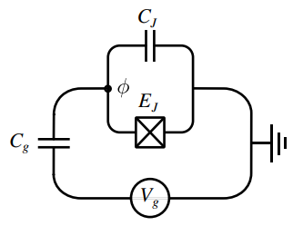
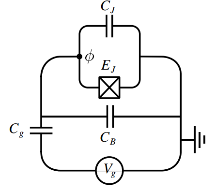
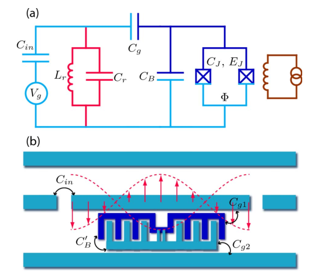

# Superconducting qubits architectures

## Cooper-pair box

  Rasmussen - Superconducting Circuit Companion </img>

## Transmon

> Transmission-line shunted plasma oscillation qubit

  Rasmussen - Superconducting Circuit Companion </img>

  Koch - Transmon </img>

- Difference from a Cooper-pair box (CPB) is the large $C_B$
- It exploits the fact that the charge dispersion reduces exponentially in EJ/EC, while the anharmonicity decreases only algebraically in EJ/EC following a power law.
